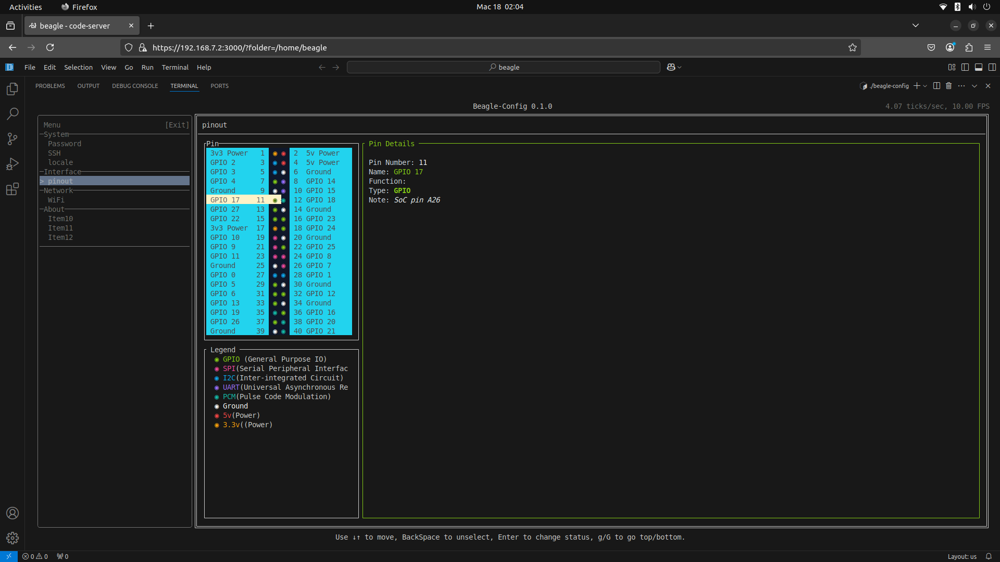
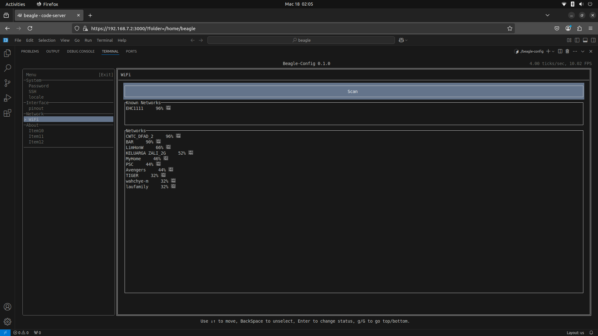

# Beagle-Config 🐾

[](https://opensource.org/licenses/MIT)

A modern Rust implementation of the BeagleBone configuration utility for BeagleBone devices. Provides terminal-based interface for hardware configuration.

## **⚠️ Project Status: Early Development**  
Most features are currently non-functional and under active development. Not recommended for production use.

## Previous Implementation
The Rust version replaces the original BeagleConfig system, maintaining compatibility while modernizing the codebase.  
[Legacy Documentation](https://docs.beagleboard.org/projects/bb-config/index.html)


## Table of Contents
- [Features](#features)
- [Prerequisites](#prerequisites)
- [Installation](#installation)
- [Usage](#usage)
- [Development](#development)
- [Contributing](#contributing)
- [License](#license)
- [Acknowledgments](#acknowledgments)

## Features
- Hardware configuration interface (PinIO)
- WiFi management (via IWD)
- System status monitoring
- Device-specific optimizations *(Planned)*

## Prerequisites

### Host Machine
- Rust 1.70+ ([Installation Guide](https://www.rust-lang.org/learn/get-started))
- Docker or Podman (for cross-compilation)
- cross-rs: `cargo install cross`

### Target Device (BeagleY-AI)
- IWD (Intel Wireless Daemon)
- Kernel: 6.6.58-ti-arm64-r23
- BeagleY-AI Debian 12.9

## Installation

### Cross-compilation (Recommended)
```bash
# ARM64 (aarch64)
cross build --target aarch64-unknown-linux-gnu

# Copy to device (adjust IP as needed)
scp ./target/aarch64-unknown-linux-gnu/debug/beagle-config beagle@192.168.7.2:/home/beagle
```

### Compilation on ARM devices
```bash
cargo run
```

## UI Example

